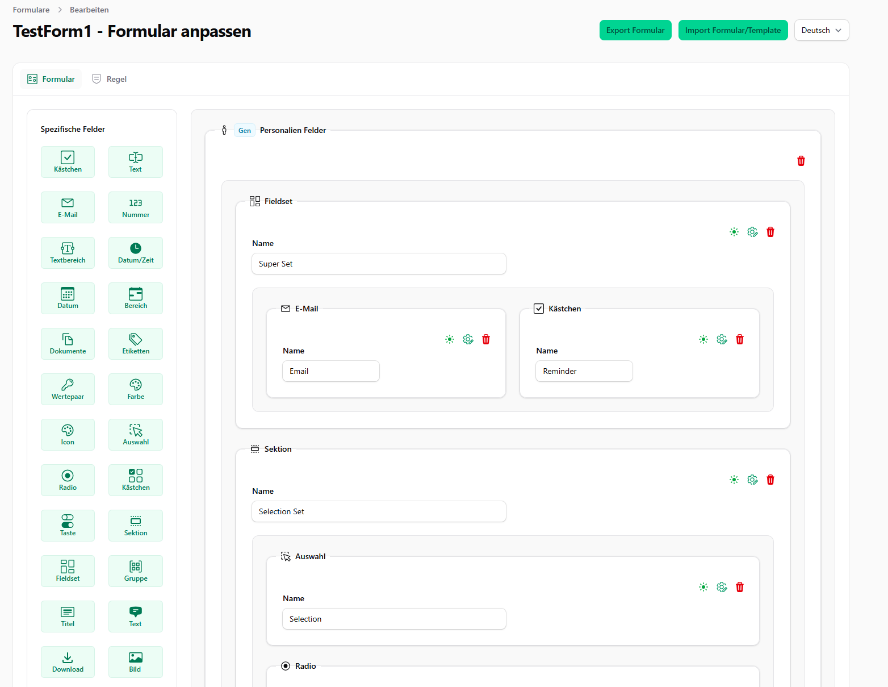
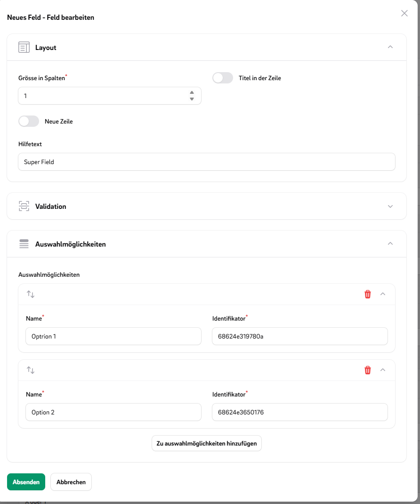
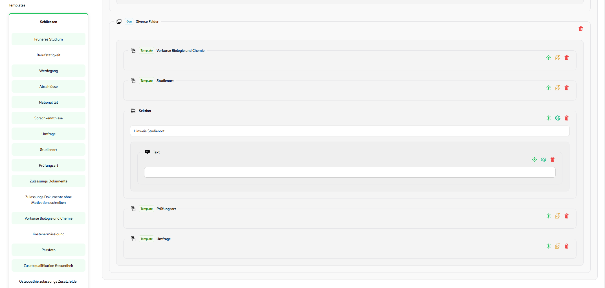
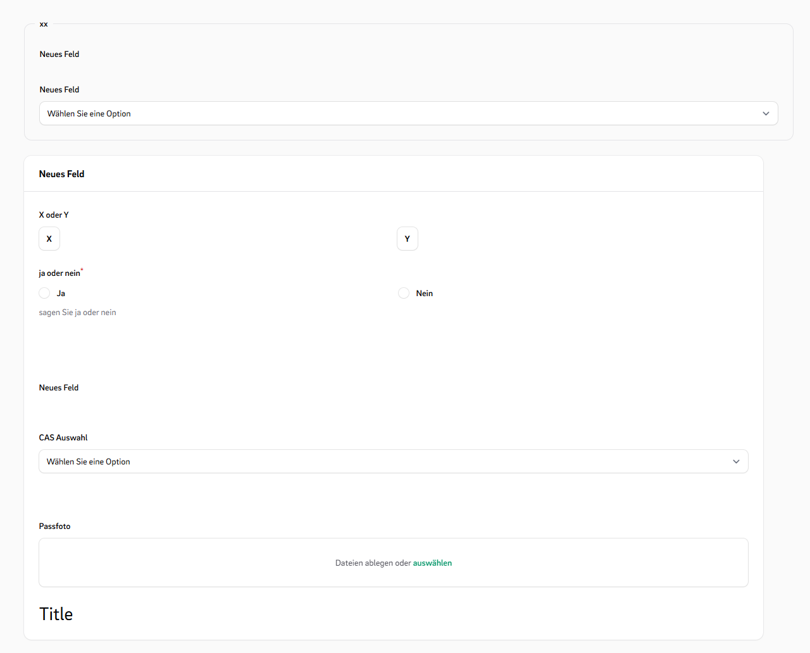
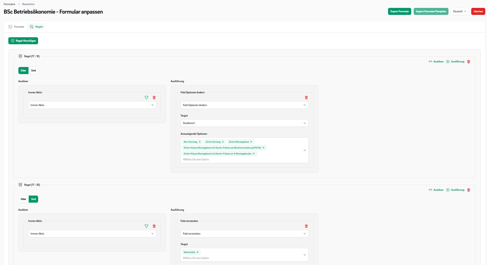
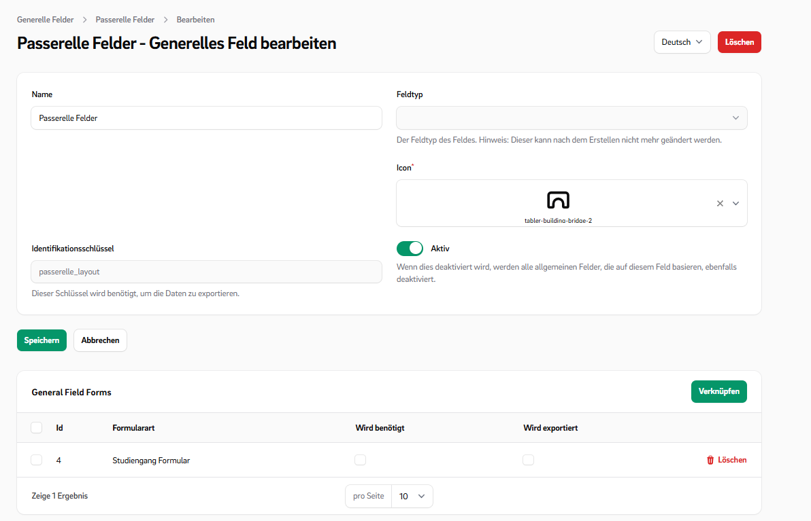
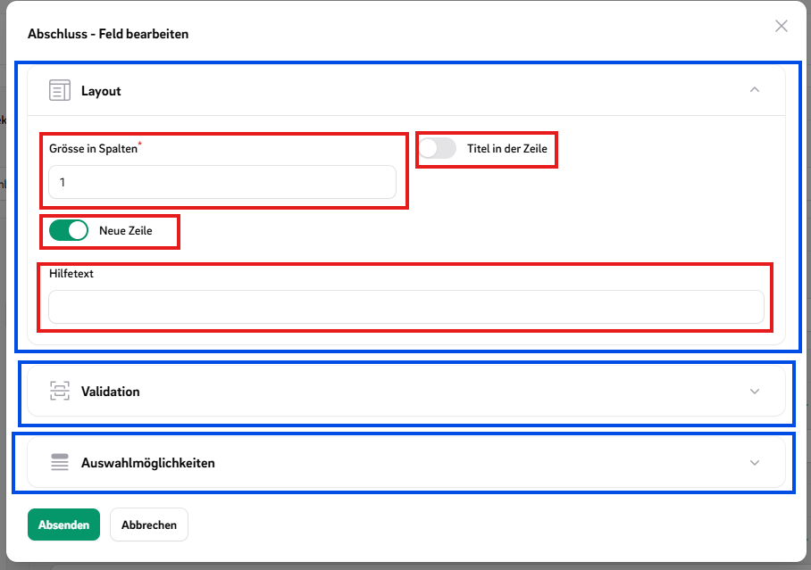

# CustomForms Overview

This plugin enables users to **create, fill out, and manage nested forms** within Filament.  
It provides a wide range of **customizable form fields** and supports rules for the forms behavior.

[](https://packagist.org/packages/ffhs/filament-package_ffhs_custom_forms)
[](https://packagist.org/packages/ffhs/filament-package_ffhs_custom_forms)

## Features:

- ✅ **Multiple Form Types**: Bind forms to different use cases (e.g. entities) through customizable form types.
- 🧩 **General Fields**: Define required general fields or exportable values that apply across form types.
- 🛠 **Configurable Field Types**: Includes various fields like Repeaters with interfaces to add additional inputs
  dynamically.
- 🤏drag & drop form builder
- 🔁 **Reactive Rules**: Set up rules that react to answers by changing field visibility or modifying selectable options.
- 🌟 **Prioritized Select Field**: Use enhanced select fields with prioritized or sorted options.
- 📄 **Template Snippets**: Create reusable form templates to streamline development.
- 🧱 **Custom Components**: Easily embed custom forms into your application using Filament components.
- 👁️ **Multiple View Modes**: Switch rendering styles based on where the form is displayed.
- 🔧 **Extensible Architecture**: Everything is designed to be customizable—add your own fields, rules, and templates as
  needed.
- ⬇️ **Import/Export**: >ou can import and export custom forms from the ui.

---

## Screenshoots

### Editor





---

### Templates



---

### Fill Form


---

### View Form

---

### Rule Editor



---

### General Fields



---

## Installation

You can install the package via composer:

```bash
composer require ffhs/filament-package_ffhs_custom_forms
```

You can publish and run the migrations with:

```bash
php artisan vendor:publish --tag="filament-package_ffhs_custom_forms-migrations"
php artisan migrate
```

You can publish the config file with:

```bash
php artisan vendor:publish --tag="filament-package_ffhs_custom_forms-config"
```

The CustomForm plugins needs [Icon Picker Plugin](https://filamentphp.com/plugins/guava-icon-picker)  You can publish
the config file with:

```bash  
php artisan vendor:publish --tag="filament-icon-picker-config"  
```  

Optionally, you can publish the views using

```bash
php artisan vendor:publish --tag="filament-package_ffhs_custom_forms-views"
```

## Usage

### 1. Register the Plugin

Add the plugin to your Filament panel provider:

```php
// App/Providers/Filament/__PanelProvider 

->plugins([CustomFormPlugin::make()])
```

---

### 2. Overview

A **Custom Form** is composed of two main parts:

- **CustomFormConfiguration** – The blueprint that defines the form’s behavior, fields, and validation rules.

- **CustomFields** – Dynamic fields rendered within the form.

You can define multiple form configurations to serve different purposes.  
For example:

- A registration form with specific dependencies and validations.
- A survey form with its own layout and logic.

---

### 3. Creating a Form Configuration

To define a new form, extend the `CustomFormConfiguration` class:

```php
use Ffhs\FilamentPackageFfhsCustomForms\CustomForms\CustomForm\FormConfiguration\CustomFormConfiguration;  

class SimpleForm extends CustomFormConfiguration {  

	public static function identifier(): string     {         
		return 'simple_form';     
	}      
	
	public static function displayName(): string
	{         
		return __('Simple Form');     
	} 
}
```

**Key methods:**

- `identifier()` – Uniquely links saved form entries to the corresponding configuration.
- `displayName()` – Shown in Filament’s form selection dropdown.

---

### 4. Registering Form Configurations

After creating a new configuration, register it in the `ffhs_custom_forms` config file:

```php
// config/ffhs_custom_forms.php 
'forms' => [     SimpleForm::class, ],`
```

**Notes:**

- Add each configuration class to the `forms` array.
- Run `php artisan config:clear` or reload the configuration cache after making changes.

## Features  explaned

### ✅ Form Configurations (FormTypes)

You can create different **FormTypes**, each with its own set of available **FieldTypes** and required **GeneralFields
**. This allows you to customize forms for different application scenarios.

For example, you might have custom forms for requests and custom forms for applications. Now you can create two
different FormTypes:

- One requires a general field for the **study location**
- The other does **not** include this field

This makes the form system flexible and reusable across various use cases.

```php
CustomFormConfiguration.php
```

#### Other Function to Overwrite

| Method Signature                                       | Description                                                                                                                                                                                                                                        |
|--------------------------------------------------------|----------------------------------------------------------------------------------------------------------------------------------------------------------------------------------------------------------------------------------------------------|
| `formFieldTypes(): array`                              | Returns the available **custom field types** that can be used in the form editor.<br>- **Source:** `CustomFieldType::getSelectableFieldTypes()`<br>- **Purpose:** Determines which field types are selectable when building or editing forms.      |
| `getRuleTriggerTypes(): array`                         | Returns the list of **trigger types** used in form rule definitions.<br>- **Source:** `config('ffhs_custom_forms.rule.trigger')`<br>- **Example values:** `on_change`, `on_submit`, etc.                                                           |
| `getRuleEventTypes(): array`                           | Returns the list of **event types** that define what happens when a rule is triggered.<br>- **Source:** `config('ffhs_custom_forms.rule.event')`<br>- **Example values:** `show_field`, `hide_field`, `set_value`, etc.                            |
| `editorFieldAdder(): array`                            | Returns the available **field adders** used in the form editor interface.<br>- **Source:** `config('ffhs_custom_forms.editor.field_adders')`<br>- **Purpose:** Defines which buttons or UI elements are available for adding fields in the editor. |
| `overwriteViewModes(): array`                          | Returns an array of **custom view modes** that override the default ones.<br>- **Default:** An empty array, meaning no overrides by default.<br>- **Use case:** Can be extended by child classes to customize how the form is rendered.            |
| `abstract public static function identifier(): string` | An **abstract method** that must be implemented by each concrete FormType class.<br>- **Purpose:** Returns a unique identifier string for the FormType (e.g. `"application"`, `"registration"`).                                                   |
| `displayViewMode(): string`                            | Returns the **view mode** to use when displaying the form.<br>- **Default:** Uses `defaultViewMode()`.                                                                                                                                             |
| `displayEditMode(): string`                            | Returns the **edit mode** to use when modifying the form.<br>- **Default:** Uses `defaultViewMode()`.                                                                                                                                              |
| `displayCreateMode(): string`                          | Returns the **create mode** to use when creating a new instance of the form.<br>- **Default:** Uses `defaultViewMode()`.                                                                                                                           |
| `defaultViewMode(): string`                            | Returns the **default mode name**, which is `"default"` unless overridden.                                                                                                                                                                         |

---

### CustomFields

A **CustomField** consists of:

- A **FieldType** – Defines the type and logic of the field (e.g. `TextType`, `SelectType`, etc.).
- A set of **Options** – Configuration values such as placeholder text, min/max values, selectable choices, etc.
- A **FieldTypeView** – Wich can change on an diferent ViewMode

#### Predefined Field Types

#### 📥 Input Fields

- `TextType::class`
- `EmailType::class`
- `NumberType::class`
- `TextAreaType::class`
- `DateTimeType::class`
- `DateType::class`
- `DateRangeType::class`
- `FileUploadType::class`

#### 🔘 Choice Fields

- `SelectType::class`
- `RadioType::class`
- `CheckboxListType::class`
- `ToggleButtonsType::class`

#### ✨ Special Fields

- `TagsType::class`
- `KeyValueType::class`
- `ColorPickerType::class`
- `IconSelectType::class`

#### 📐 Layout Components

- `SectionType::class
- `FieldsetType::class
- `GroupType::class
- `TitleType::class
- `TextLayoutType::class
- `DownloadType::class
- `ImageLayoutType::class
- `SpaceType::class`

#### Add an own CustomField

You can create your own reusable field type by implementing a **CustomFieldType** and a matching **View Component**.

1. Define the Field Type Class

```php
class MyType extends CustomFieldType  
{  
	public function getTranslatedName(): string  
	{  
	    return __('type.label');  
	}

    public static function identifier(): string  
    {  
        return 'text';  
    }  
  
    public function viewModes(): array  
    {  
        return [  
            'default' => MyTypeView::class,  
        ];  
    }  
  
    public function icon(): string  
    {  
        return 'bi-input-cursor-text';  
    }  
} 

```

2. Register Type in Config

```php
// config/ffhs_custom_forms.php
'custom_field_types' => [  
    MyType::class,
    ...
]
```

3. Define the Field Type View

```php
class MyTypeView implements FieldTypeView  
{  
    use HasDefaultViewComponent;  
  
    public function getFormComponent(  
        CustomFieldType $type,  
        CustomField $record,  
        array $parameter = []  
    ): FormsComponent {  
        /** @var TextInput $input */  
        return $input = $this->makeComponent(TextInput::class, $record);  
    }  
  
    public function getInfolistComponent(  
        CustomFieldType $type,  
        CustomFieldAnswer $record,  
        array $parameter = []  
    ): InfolistsComponent {  
        /** @var TextEntry $input */  
        return $input = $this->makeComponent(TextEntry::class, $record);  
    }  
}
```

#### Other Functions

These optional methods can be overridden in your custom `CustomFieldType` class to control behavior during field
editing, rendering, saving, and cloning.

| Method Signature                                                | Description                                                                                                                                                                                 |
|-----------------------------------------------------------------|---------------------------------------------------------------------------------------------------------------------------------------------------------------------------------------------|
| `canBeDeactivate(): bool`                                       | Returns `true` if this field type can be **deactivated** (Hidden), otherwise `false`.                                                                                                       |
| `generalTypeOptions(): array`                                   | Returns a list of general type options for this field type.                                                                                                                                 |
| `extraTypeOptions(): array`                                     | Returns additional, type options specific to this field type.                                                                                                                               |
| `beforeSaveField(CustomField $field, array $data): void`        | Called **before a field is saved**. Use it to preprocess or validate field data before it’s persisted.                                                                                      |
| `afterSaveField(CustomField $field, array $data): void`         | Called **after the field has been saved**. Use it to trigger post-save logic such as logging or syncing related data.                                                                       |
| `afterCreateField(CustomField $field, array $data): void`       | Called **after a new field is created**. Useful for generating default options or setting up linked records.                                                                                |
| `afterDeleteField(CustomField $field): void`                    | Called **after a field has been deleted**. Can be used to clean up orphaned records or perform audits.                                                                                      |
| `mutateOnCloneField(array $data, CustomField $original): array` | Allows you to **modify data when a field is cloned** (on dissolve template). Example: Reset values or generate unique identifiers.                                                          |
| `isFullSizeField(): bool`                                       | Returns `true` if the field should take the **full width** of the form layout. Useful for large inputs like `TextArea` or `FileUpload`. Default: `false`.                                   |
| `getEditorFieldBadge(array $rawData): ?string`                  | Returns an optional **badge label** shown in the field editor. Return `null` for no badge. Used to identify general fields and templates.                                                   |
| `getEditorFieldTitle(array $rawData, CustomForm $form): string` | Returns the **title** shown for the field in the form editor. Useful for showing the question label, field name, or summary.                                                                |
| `fieldEditorExtraComponent(array $rawData): ?string`            | Returns a reference to a **custom editor UI component** (e.g. Vue or Blade). Rendered in the field's editor panel. Return `null` to disable.                                                |
| `getEditorActions(string $key, array $rawData): array`          | Returns a list of **editor actions** (buttons, dropdowns) for the field editor.<br>Example: Returns delete, edit, and activation actions, with visibility depending on `canBeDeactivate()`. |

---

### Type Options

the Type options are options components wich can add to an fieldtype to modify the components.
The Type Options can automaticle apply some effects if the
`return $input = $this->makeComponent(TextInput::class, $record);` is used in the TypeView.

#### Prefefined Type Option Classes

These classes define configurable type options used in custom form fields.

1. `ActionLabelTypeOption.php`
2. `AlpineMaskOption.php`
3. `BooleanOption.php`
4. `ColumnsOption.php`
5. `ColumnSpanOption.php`
6. `DateFormatOption.php
7. `HelperTextTypeOption.php`
8. `IconOption.php`
9. `ImaginaryTypeOption.php`
10. `InLineLabelOption.php`
11. `InlineOption.php`
12. `MaxAmountOption.php`
13. `MaxLengthOption.php`
14. `MaxSelectOption.php`
15. `MaxValueOption.php`
16. `MinAmountOption.php`
17. `MinLengthOption.php`
18. `MinSelectOption.php`
19. `MinValueOption.php`
20. `NewLineOption.php`
21. `RelatedFieldOption.php`
22. `ReorderableTypeOption.php`
23. `RequiredOption.php`
24. `ShowAsFieldsetOption.php`
25. `ShowInViewOption.php`
26. `ShowLabelOption.php`
27. `ValidationAttributeOption.php`
28. `ValidationMessageOption.php`

#### Using Type Options in a Custom Field Type

You can add **extra type options** to your custom field by overriding `extraTypeOptions()` or `generalTypeOptions()`:

```php
//MyType.php
public function extraTypeOptions(): array  
{  
    return [  
       'alpine_mask' => AlpineMaskOption::make()
	       ->modifyDefault(fn($oldDefault) => '...'),  
        'max_length' => MaxLengthOption::make()
	       ->modifyOptionComponent(fn($component) => $component->columnStart(1)),    
        'min_length' => MinLengthOption::make(),  
    ];  
}
```

- Each key represents the **option name**.
- The value is an instance of a `TypeOption`, usually created via `::make()`.
- You can customize how the option behaves using methods like `modifyDefault()` or `modifyOptionComponent()`.

#### Creating a Custom Type Option

To create your own option, extend the `TypeOption` class:

```php
class MyTypeOption extends TypeOption  
{  
  
    public function getDefaultValue(): mixed  
    {  
        return null;  
    }  
  
    public function getComponent(string $name): Component  
    {  
        return Toggle::make($name)  
            ->label('MyTypeOption')  
            ->columnSpanFull()  
            ->live();  
    }  
    
	public function modifyFormComponent(FormsComponent $component, mixed $value): FormsComponent  
	{  
	    return $component->modify(...);  
	}  
	  
	public function modifyInfolistComponent(InfolistComponent $component, mixed $value): InfolistComponent  
	{  
	    return $component->modify(...);  
	}
}
```

#### Other Optional Function

| Method                         | Purpose                                                                         |
|--------------------------------|---------------------------------------------------------------------------------|
| `mutateOnFieldSave()`          | Modify data **before it's saved** to the field                                  |
| `mutateOnFieldLoad()`          | Modify data **when it's loaded**                                                |
| `beforeSaveField()`            | Hook before the field is saved (via reference)                                  |
| `afterSaveField()`             | Hook after the field is saved (via reference)                                   |
| `afterCreateField()`           | Triggered right after the field is created                                      |
| `beforeDeleteField()`          | Hook before the field is deleted                                                |
| `afterDeleteField()`           | Hook after the field is deleted                                                 |
| `mutateOnFieldClone()`         | Modify option data when cloning the field                                       |
| `canBeOverwrittenByNonField()` | Whether this option can be overwritten globally or externally (default: `true`) |

#### Use FastTypeOption

**FastTypeOption** allows you to quickly add custom options directly in your `FieldType` and react to them in your
`FieldTypeView`.

```php
//MyType.php
public function extraTypeOptions(): array  
{  
    return [  
       'my_option' => FastTypeOption::makeFast(  
		    default: false,  
		    Toggle::make('my_option')
		)
    ];  
}
```

```php
//MyTypeView.php
$myOption = $this->getOptionParameter($record, 'my_option');

/** @var TextInput $input */  
$input = $this->makeComponent(TextInput::class, $record);

if($myOption){
	$input->modify(...);
}

return $input
```

### OptionsGroups

Option groups help organize multiple related type options into logical collections, making your field configuration
cleaner and easier to manage.

In the Image are options marked red and the Option groups are maked as blue.


#### Example to use Option Groups

```php
//MyType.php
public function extraTypeOptions(): array  
{  
    return [  
       TypeOptionGroup::make('MyGroup', [  
		    'alpine_mask' => AlpineMaskOption::make(),  
			'max_length' => MaxLengthOption::make(),  
			'min_length' => MinLengthOption::make(),
		]),
		ValidationTypeOptionGroup::make(),  
	    LayoutOptionGroup::make()
		    ->mergeTypeOptions([  
			    'my_option' => MyTypeOption::make(),  
			])
			->removeTypeOption('...'),
    ];  
}
```

---

### Rules Events & Triggers

Rules can be divided into events and triggers. Triggers cause events to be executed. A rule can consist of multiple
triggers that can be combined using AND or OR logic and can execute multiple events.

#### Predefined Events

- `HideEvent`
- `VisibleEvent`
- `DisabledEvent`
- `RequiredEvent`
- `ChangeOptionsEvent`

#### Predefined Triggers

- `IsInfolistTrigger`
- `ValueEqualsRuleTrigger`
- `AlwaysRuleTrigger`

#### Create own Trigger

1. Create an MyTrigger class

```php
// MyTrigger.php
class MyTrigger extends FormRuleTriggerType  
{  
	use HasTriggerEventFormTargets; // <= Adds an CustomField Select
	
    public static function identifier(): string  
    {  
        return 'my_trigger';  
    }  
  
    public function getDisplayName(): string  
    {  
        return 'My Trigger';  
    }  
  
    public function isTrigger(array $arguments, mixed &$target, RuleTrigger $rule): bool  
    {  
      return ...;
    }  
  
    public function getFormSchema(): array  
    {  
        return [  
            Toggle::make('option for my trigger'),
            this->getTargetSelect() // <= Adds an CustomField Select
        ];  
    }  
}
```

2. Add your trigger class in the config file:

```php  
// config/ffhs_custom_forms.php
'trigger' => [
	MyTrigger::class
	...
]  
```  

#### Create own Event

1. Create an MyTrigger classe

```php
// MyTrigger.php
class MyEvent extends FormRuleEventType  
{  
	use HasTriggerEventFormTargets; // <= Adds an CustomField Select
	
    public static function identifier(): string  
    {  
        return 'my_event';  
    }  
  
    public function getDisplayName(): string  
    {  
        return 'My Event';  
    }  
  
    public function getFormSchema(): array  
    {  
        return [  
            Toggle::make('option for my trigger'),
            this->getTargetSelect() // <= Adds an CustomField Select
        ];  
    }  

	    // Implement one or more handler functions below depending on your use case:
    // - handleAnswerLoadMutation
    // - handleAnswerSaveMutation
    // - handleBeforeRender
    // - handleAfterRenderForm
    // - handleAfterRenderInfolist
}
```

2. Add your event class in the config file:

```php  
// config/ffhs_custom_forms.php
'event' => [
	MyEvent::class
	...
],  
```  

---

### Embed Custom Forms in Other Places

You can embed custom forms or their answers in various parts of your application using specialized components. Below are
examples of usage patterns and customization options.

#### Editor

Embed the form editor in your layout using `CustomFormEditor`:

```php
CustomFormEditor::make('custom_forms')
	->relationship('customForm')
```

#### Form Answer Edit

Embed a form for editing its answer using `EmbeddedCustomForm`.
**Basic usage:**

```php
EmbeddedCustomForm::make('custom_form_answer')
	->relationship('customFormAnswer')
```

With automatic saving:

```php
EmbeddedCustomForm::make('custom_form_answer')
	->relationship('customFormAnswer')
	->autoSave()
```

Split layout by section type:

```php
EmbeddedCustomForm::make('custom_form_answer')
	->relationship('customFormAnswer')
	->useLayoutTypeSplit()
	->layoutTypeSplit(SectionType::make())
```

Split layout by specific fields:

```php
EmbeddedCustomForm::make('custom_form_answer')
	->relationship('customFormAnswer')
	->useFieldSplit()
	->fieldSplit(CustomField....)
```

Split layout by pose (e.g. question number range):

```php
EmbeddedCustomForm::make('custom_form_answer')
	->relationship('customFormAnswer')
	->usePoseSplit()
	->poseSplitStart(5)
	->poseSplitEnd(10)
```

#### Form Answer Infolist

Embed a form for editing its answer using `EmbeddedCustomForm`.

**Basic usage:**

```php
EmbeddedAnswerInfolist::make('custom_form_answer')
	->relationship('customFormAnswer')
```

Split layout by section type:

```php
EmbeddedAnswerInfolist::make('custom_form_answer')
	->relationship('customFormAnswer')
	->useLayoutTypeSplit()
	->layoutTypeSplit(SectionType::make())
```

Split layout by specific fields:

```php
EmbeddedAnswerInfolist::make('custom_form_answer')
	->relationship('customFormAnswer')
	->useFieldSplit()
	->fieldSplit(CustomField....)
```

Split layout by pose (e.g. question number range):

```php
EmbeddedAnswerInfolist::make('custom_form_answer')
	->relationship('customFormAnswer')
	->usePoseSplit()
	->poseSplitStart(5)
	->poseSplitEnd(10)
```

---

## Testing

```bash  
composer install
./vendor/bin/testbench vendor:publish --tag="filament-package_ffhs_custom_forms-migrations"  
./vendor/bin/testbench workbench:build
./vendor/bin/pest test  
```

## Changelog

Please see [CHANGELOG](CHANGELOG.md) for more information on what has changed recently.

## License

The MIT License (MIT). Please see [License File](LICENSE.md) for more information.
