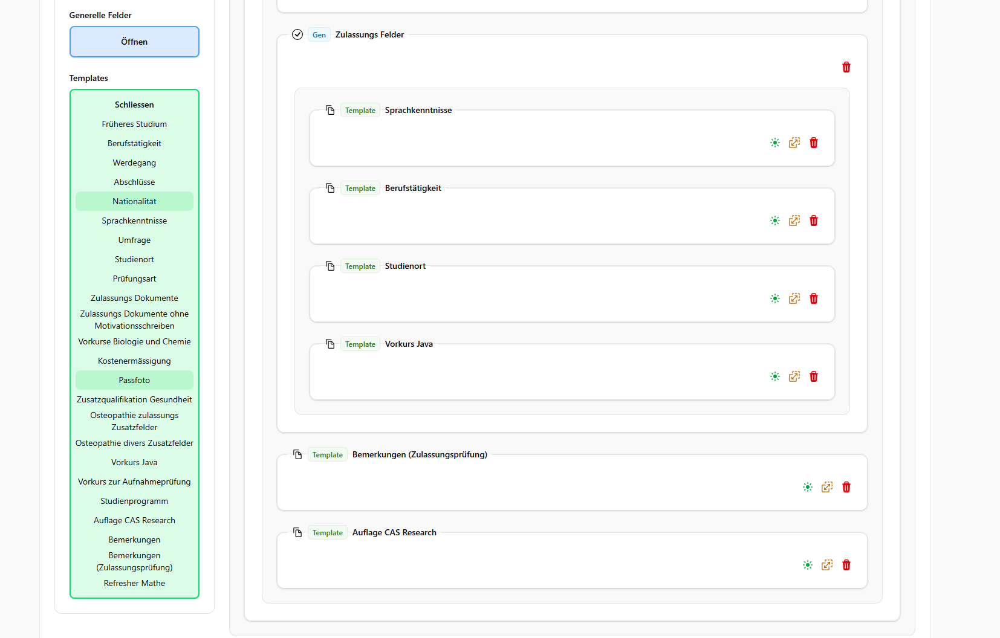
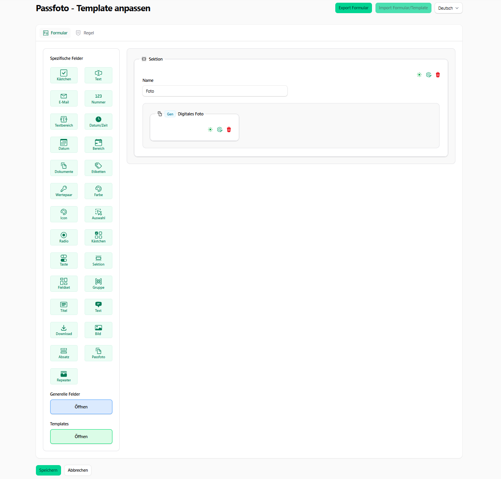
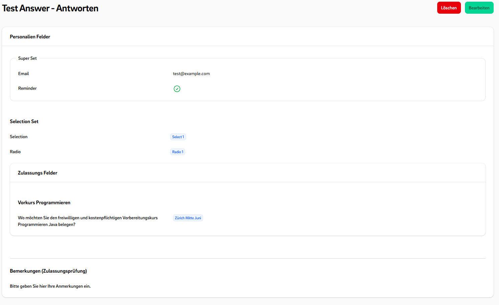
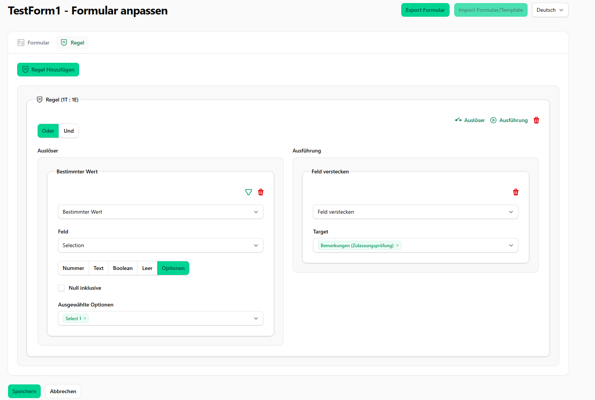
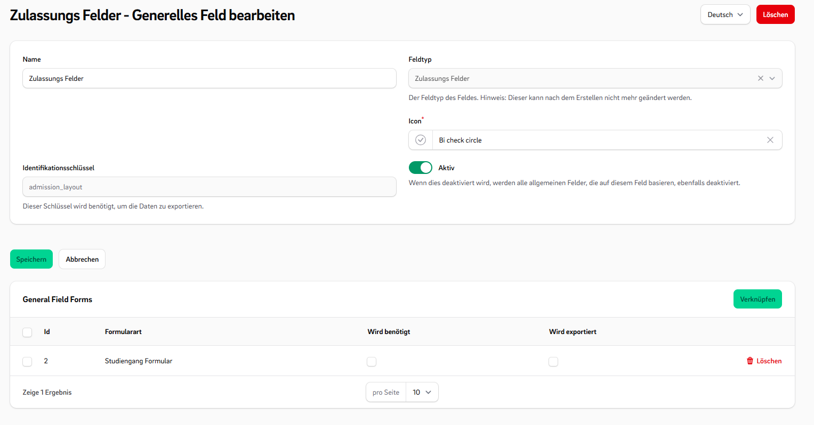

# CustomForms Overview

This plugin enables you to **create and manage nested forms** within FilamentPHP.    
It provides a wide range of **customizable form fields** and supports behavioral rules and templates.

[](https://packagist.org/packages/ffhs/filament-package_ffhs_custom_forms)  
[](https://packagist.org/packages/ffhs/filament-package_ffhs_custom_forms)

## Features:

- ✅ **Multiple Form Types**: Bind forms to different use cases (e.g. entities) through customizable form types.
- 🧩 **General Fields**: Define general fields for exports and reusability across form types.
- 🛠 **Configurable Field Types**: Includes various fields like Repeaters to add additional inputs dynamically.
- 🤏 **drag & drop** Use an intuitive form builder.
- 🔁 **Reactive Rules**: Set up rules that react to answers by changing field visibility or modifying selectable options.
- 🌟 **Prioritized Select Field**: Use enhanced select fields with prioritized or sorted options.
- 📄 **Template Snippets**: Create reusable form templates to maximize reusability.
- 🧱 **Custom Components**: Easily embed CustomForms into your application using Filament components.
- 👁️ **Multiple View Modes**: Switch rendering styles based on where the form is used.
- 🔧 **Extensible Architecture**: Everything is designed to be customizable, add your own fields, rules, and templates.
- ⬇️ **Import/Export**: You can import and export custom forms directly from the UI..

---  

## Screenshots

### Editor


  
---  

### Templates





---  

### Fill Form


---  

### View Form



---  

### Rule Editor


  
---  

### General Fields


  
---  

## Installation

- Install the package via composer:

```bash  
composer require ffhs/filament-package_ffhs_custom_forms^2.0
```  

- Publish and run the migrations:

```bash  
php artisan vendor:publish --tag="filament-package_ffhs_custom_forms-migrations"  
php artisan migrate  
```  

- Publish the config file with:

```bash  
php artisan vendor:publish --tag="filament-package_ffhs_custom_forms-config"  
```  

- Optionally, you can publish the views using

```bash  
php artisan vendor:publish --tag="filament-package_ffhs_custom_forms-views"  
```

## Simple Usage

- **Register the Plugin** Add the plugin to your panel provider:

```php  
// App/Providers/Filament/xxPanelProvider   
  
->plugins([CustomFormPlugin::make()])  
```

Now you can try the Plugin in the Panel with the DefaultFormConfiguration.

## Wiki

I'm sorry, but the Github wiki is not yet complete.

## Features explained

### ✅ Form Configurations (FormTypes)

You can create different **FormTypes**, each with its own set of available **FieldTypes** and required **GeneralFields  
**.  
This allows you to customize forms for different application scenarios.

For example, you might have custom forms for requests and custom forms for applications. Now you can create two  
different FormTypes:

- One requires a general field for the **study location**
- The other does **not** include this field

This makes the form system flexible and reusable across various use cases.

---  

### CustomFields

A **CustomField** consists of:

- A **FieldType** – Defines the type and logic of the field (e.g. `TextType`, `SelectType`, etc.).
- A set of **Options** – Configuration values such as placeholder text, min/max values, selectable choices, etc.
- A **FieldTypeView** – Which can change on a different ViewMode

#### Predefined Field Types

#### 📥 Input Fields

- `TextType::class`
- `EmailType::class`
- `NumberType::class`
- `TextAreaType::class`
- `DateTimeType::class`
- `DateType::class`
- `DateRangeType::class`
- `FileUploadType::class`
- `CheckboxType::class`

#### 🔘 Choice Fields

- `SelectType::class`
- `RadioType::class`
- `CheckboxListType::class`
- `ToggleButtonsType::class`

#### ✨ Special Fields

- `TagsType::class`
- `KeyValueType::class`
- `ColorPickerType::class`
- `IconSelectType::class`

#### 📐 Layout Components

- `SectionType::class`
- `FieldsetType::class`
- `GroupType::class`
- `TitleType::class`
- `TextLayoutType::class`
- `DownloadType::class`
- `ImageLayoutType::class`
- `SpaceType::class`
- `RepeaterLayoutType::class`

---  

### TypeOptions

The TypeOptions are options components which can add to a field-type to modify the components.  
The TypeOptions can automatically apply some effects if the  
`return $input = $this->makeComponent(TextInput::class, $record);` is used in the TypeView.

#### Predefined Type Option Classes

These classes define configurable TypeOptions used in CustomFormFields.

1. `ActionLabelTypeOption.php`
2. `AllowedFileTypeOption.php`
3. `AlpineMaskOption.php`
4. `AmountOption.php`
5. `AsideOption.php`
6. `BooleanOption.php`
7. `ColorTypeOption.php`
8. `ColumnsOption.php`
9. `ColumnSpanOption.php`
10. `DateFormatOption.php`
11. `DefaultAmountOption.php`
12. `Downloadable.php`
13. `FastTypeOption.php`
14. `GridLayoutOption.php`
15. `GroupedOption.php`
16. `HelperTextTypeOption.php`
17. `HiddenLabelOption.php`
18. `IconOption.php`
19. `ImaginaryTypeOption.php`
20. `InLineLabelOption.php`
21. `InLineOption.php`
22. `MaxAmountOption.php`
23. `MaxLengthOption.php`
24. `MaxSelectOption.php`
25. `MaxValueOption.php`
26. `MinAmountOption.php`
27. `MinLengthOption.php`
28. `MinSelectOption.php`
29. `MinValueOption.php`
30. `MultipleOption.php`
31. `NewLineOption.php`
32. `OpenInNewTabOption.php`
33. `PreserveFilenamesOption.php`
34. `RelatedFieldOption.php`
35. `ReorderableTypeOption.php`
36. `RequiredOption.php`
37. `SeveralOption.php`
38. `ShowAsFieldsetOption.php`
39. `ShowAsFieldsOption.php`
40. `ShowImagesOption.php`
41. `ShowInViewOption.php`
42. `ShowLabelOption.php`
43. `ShowLinkOption.php`
44. `SuggestionsOption.php`
45. `TextOption.php`
46. `ValidationAttributeOption.php`
47. `ValidationMessageOption.php`

#### Using TypeOptions in a CustomFieldType

You can add **extra type options** to your custom field by overriding `extraTypeOptions()` or `generalTypeOptions()`:

```php  
// MyType.php  
public function extraTypeOptions(): array  {    
    return [    
       'alpine_mask' => AlpineMaskOption::make()  
           ->modifyDefault(fn($oldDefault) => '...'),    
       'max_length' => MaxLengthOption::make()  
           ->modifyOptionComponent(fn($component) => $component->columnStart(1)),      
       'min_length' => MinLengthOption::make(),    
    ];    
}  
```  

- Each key represents the **option name**.
- The value is an instance of a `TypeOption`, usually created via `::make()`.
- You can customize how the option behaves using methods like `modifyDefault()` or `modifyOptionComponent()`.

#### Use FastTypeOption

**FastTypeOption** allows you to quickly add custom options directly in your `FieldType` and react to them in your  
`FieldTypeView`.

```php  
//MyType.php  
public function extraTypeOptions(): array  {    
    return [    
       'my_option' => FastTypeOption::makeFast(    
           default: false,    
           fn($name) => Toggle::make($name)  
       )  
    ];    
}  
```  

```php  
// MyTypeView.php  
$myOption = $this->getOptionParameter($record, 'my_option');  
  
/** @var TextInput $input */    
$input = $this->makeComponent(TextInput::class, $record);  
  
if($myOption){  
    $input->modify(...);  
}  
  
return $input  
```  

### OptionsGroups

OptionsGroups help organize multiple related TypeOptions into logical collections,  
making your field configuration cleaner and easier to manage.

In the image TypeOptions are marked red and the OptionGroups are marked blue.  


#### How to use OptionGroups?

```php  
//MyType.php  
public function extraTypeOptions(): array  {    
    return [    
        TypeOptionGroup::make('MyGroup', [    
           'alpine_mask' => AlpineMaskOption::make(),    
          'max_length' => MaxLengthOption::make(),    
          'min_length' => MinLengthOption::make(),  
       ]),  
       ValidationTypeOptionGroup::make(),    
        LayoutOptionGroup::make()  
           ->mergeTypeOptions([    
              'my_option' => MyTypeOption::make(),    
          ])  
          ->removeTypeOption('...'),  
    ];    
}  
```  

  
---  

### Rules: Events and Triggers

Rules can be divided into events and triggers. Triggers cause events to be executed. A rule can consist of multiple  
triggers that can be combined using 'AND' or 'OR' logic and can execute multiple events.

#### Predefined Events

- `HideEvent`
- `VisibleEvent`
- `DisabledEvent`
- `RequiredEvent`
- `ChangeOptionsEvent`

#### Predefined Triggers

- `IsInfolistTrigger`
- `ValueEqualsRuleTrigger`
- `AlwaysRuleTrigger`

---  

### Embed CustomForms

You can embed CustomForms or their answers in various parts of your application using specialized components. Below
are  
examples of usage patterns and customization options.
  
---  

## Testing

```bash  composer install  
./vendor/bin/testbench vendor:publish --tag="filament-package_ffhs_custom_forms-migrations"    
./vendor/bin/testbench workbench:build  
./vendor/bin/pest test    
```  

## Postcards

We highly appreciate you sending us a postcard.  
You'll find our address on our [page](https://www.ffhs.ch/).

## License

The MIT License (MIT). Please see [License File](LICENSE.md) for more information.
