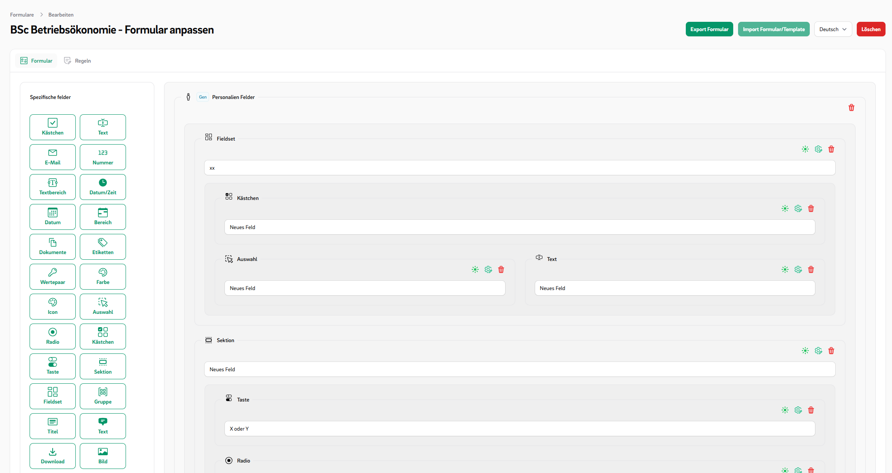

onent->columnStart(1)),    
'min_length' => MinLengthOption::make(),  
];  
}

```
- Each key represents the **option name**.
- The value is an instance of a `TypeOption`, usually created via `::make()`.
- You can customize how the option behaves using methods like `modifyDefault()` or `modifyOptionComponent()`.

#### Creating a Custom Type Option
To create your own option, extend the `TypeOption` class:
```php
class MyTypeOption extends TypeOption  
{  
  
    public function getDefaultValue(): mixed  
    {  
        return null;  
    }  
  
    public function getComponent(string $name): Component  
    {  
        return Toggle::make($name)  
            ->label('MyTypeOption')  
            ->columnSpanFull()  
            ->live();  
    }  
    
	public function modifyFormComponent(FormsComponent $component, mixed $value): FormsComponent  
	{  
	    return $component->modify(...);  
	}  
	  
	public function modifyInfolistComponent(InfolistComponent $component, mixed $value): InfolistComponent  
	{  
	    return $component->modify(...);  
	}
}
```

#### Other Optional Function

| Method                         | Purpose                                                                         |
|--------------------------------|---------------------------------------------------------------------------------|
| `mutateOnFieldSave()`          | Modify data **before it's saved** to the field                                  |
| `mutateOnFieldLoad()`          | Modify data **when it's loaded**                                                |
| `beforeSaveField()`            | Hook before the field is saved (via reference)                                  |
| `afterSaveField()`             | Hook after the field is saved (via reference)                                   |
| `afterCreateField()`           | Triggered right after the field is created                                      |
| `beforeDeleteField()`          | Hook before the field is deleted                                                |
| `afterDeleteField()`           | Hook after the field is deleted                                                 |
| `mutateOnFieldClone()`         | Modify option data when cloning the field                                       |
| `canBeOverwrittenByNonField()` | Whether this option can be overwritten globally or externally (default: `true`) |

#### Use FastTypeOption

**FastTypeOption** allows you to quickly add custom options directly in your `FieldType` and react to them in your
`FieldTypeView`.

```php
//MyType.php
public function extraTypeOptions(): array  
{  
    return [  
       'my_option' => FastTypeOption::makeFast(  
		    default: false,  
		    Toggle::make('my_option')
		)
    ];  
}
```

```php
//MyTypeView.php
$myOption = $this->getOptionParameter($record, 'my_option');

/** @var TextInput $input */  
$input = $this->makeComponent(TextInput::class, $record);

if($myOption){
	$input->modify(...);
}

return $input
```

### OptionsGroups

Option groups help organize multiple related type options into logical collections, making your field configuration
cleaner and easier to manage.

In the Image are options marked red and the Option groups are maked Red.


#### Example to use Option Groups

```php
//MyType.php
public function extraTypeOptions(): array  
{  
    return [  
       TypeOptionGroup::make('MyGroup', [  
		    'alpine_mask' => AlpineMaskOption::make(),  
			'max_length' => MaxLengthOption::make(),  
			'min_length' => MinLengthOption::make(),
		]),
		ValidationTypeOptionGroup::make(),  
	    LayoutOptionGroup::make()
		    ->mergeTypeOptions([  
			    'my_option' => MyTypeOption::make(),  
			])
			->removeTypeOption('...'),
    ];  
}
```

---

### Rules Events & Triggers

Rules can be divided into events and triggers. Triggers cause events to be executed. A rule can consist of multiple
triggers that can be combined using AND or OR logic and can execute multiple events.

#### Predefined Events

- `HideEvent`
- `VisibleEvent`
- `DisabledEvent`
- `RequiredEvent`
- `ChangeOptionsEvent`

#### Predefined Triggers

- `IsInfolistTrigger`
- `ValueEqualsRuleTrigger`
- `AlwaysRuleTrigger`

#### Create own Trigger

1. Create an MyTrigger classe

```php
// MyTrigger.php
class MyTrigger extends FormRuleTriggerType  
{  
	use HasTriggerEventFormTargets; // <= Adds an CustomField Select
	
    public static function identifier(): string  
    {  
        return 'my_trigger';  
    }  
  
    public function getDisplayName(): string  
    {  
        return 'My Trigger';  
    }  
  
    public function isTrigger(array $arguments, mixed &$target, RuleTrigger $rule): bool  
    {  
      return ...;
    }  
  
    public function getFormSchema(): array  
    {  
        return [  
            Toggle::make('option for my trigger'),
            this->getTargetSelect() // <= Adds an CustomField Select
        ];  
    }  
}
```

2. Add your trigger class in the config file:

```php  
// config/ffhs_custom_forms.php
'trigger' => [
	MyTrigger::class
	...
]  
```  

#### Create own Event

1. Create an MyTrigger classe

```php
// MyTrigger.php
class MyEvent extends FormRuleEventType  
{  
	use HasTriggerEventFormTargets; // <= Adds an CustomField Select
	
    public static function identifier(): string  
    {  
        return 'my_event';  
    }  
  
    public function getDisplayName(): string  
    {  
        return 'My Event';  
    }  
  
    public function getFormSchema(): array  
    {  
        return [  
            Toggle::make('option for my trigger'),
            this->getTargetSelect() // <= Adds an CustomField Select
        ];  
    }  

	    // Implement one or more handler functions below depending on your use case:
    // - handleAnswerLoadMutation
    // - handleAnswerSaveMutation
    // - handleBeforeRender
    // - handleAfterRenderForm
    // - handleAfterRenderInfolist
}
```

2. Add your event class in the config file:

```php  
// config/ffhs_custom_forms.php
'event' => [
	MyEvent::class
	...
],  
```  

  
---

## Images

### Editor




---

### Templates


---

### Fill Form


---

### Rule Editor


---

### General Fields


## Testing

```bash  
composer install
./vendor/bin/testbench vendor:publish --tag="filament-package_ffhs_custom_forms-migrations"  
./vendor/bin/testbench workbench:build
./vendor/bin/pest test  
```  
  
